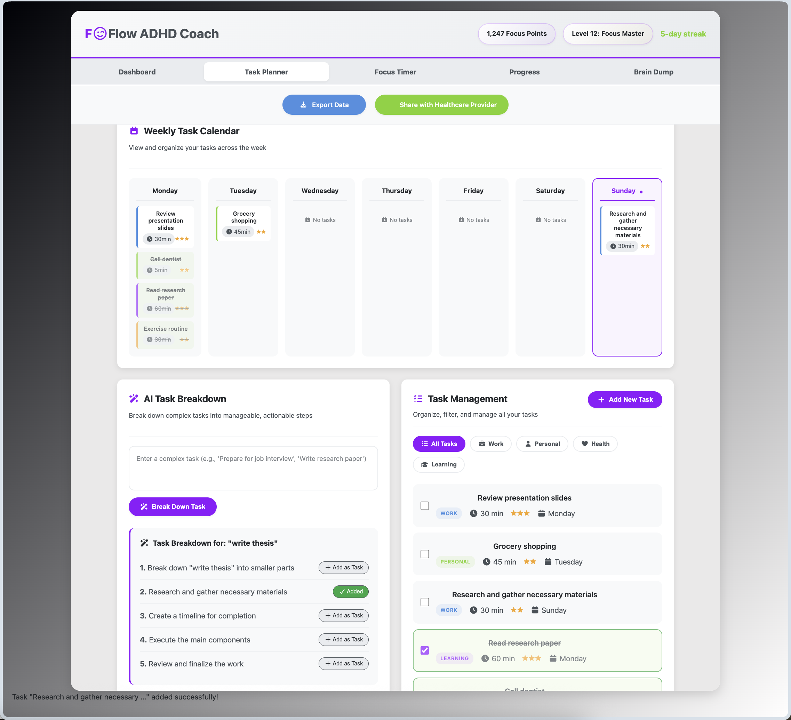
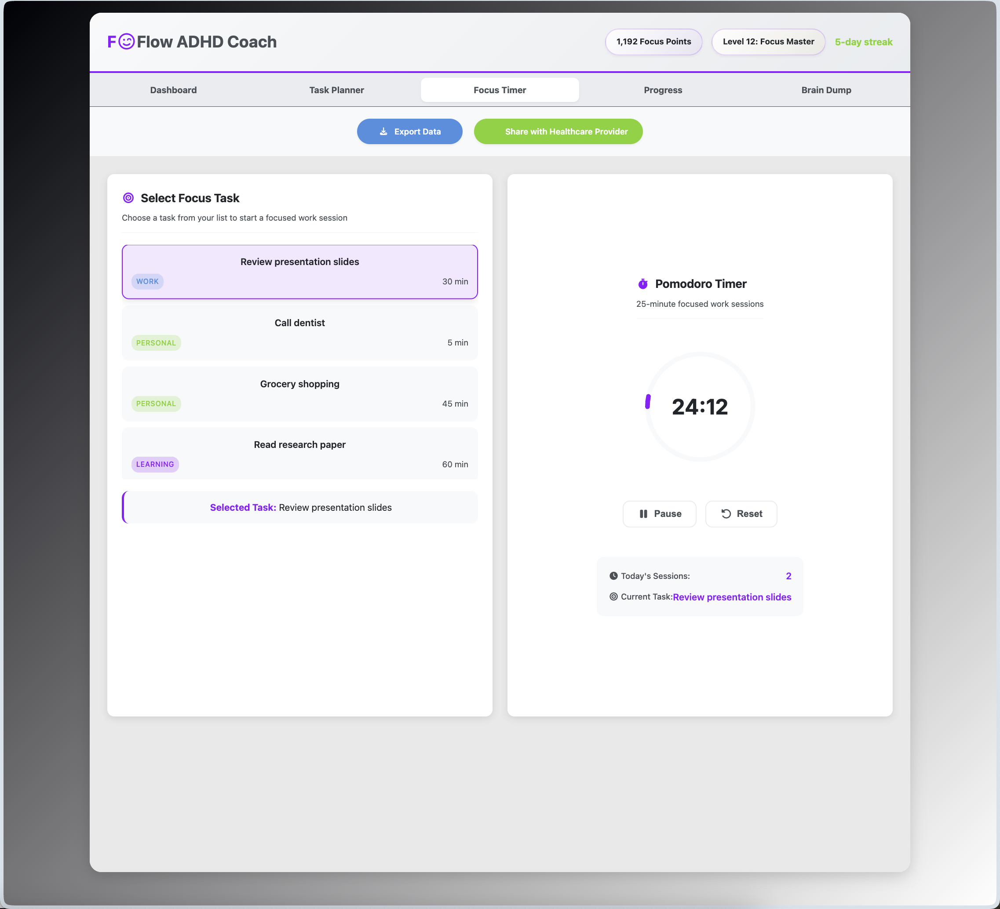
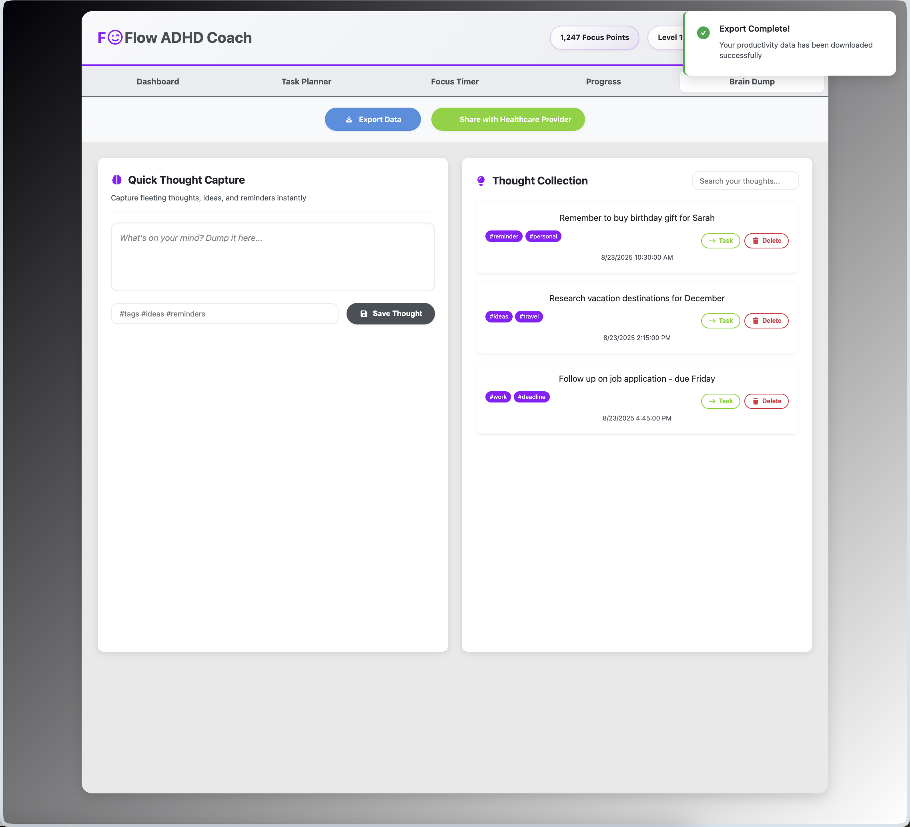
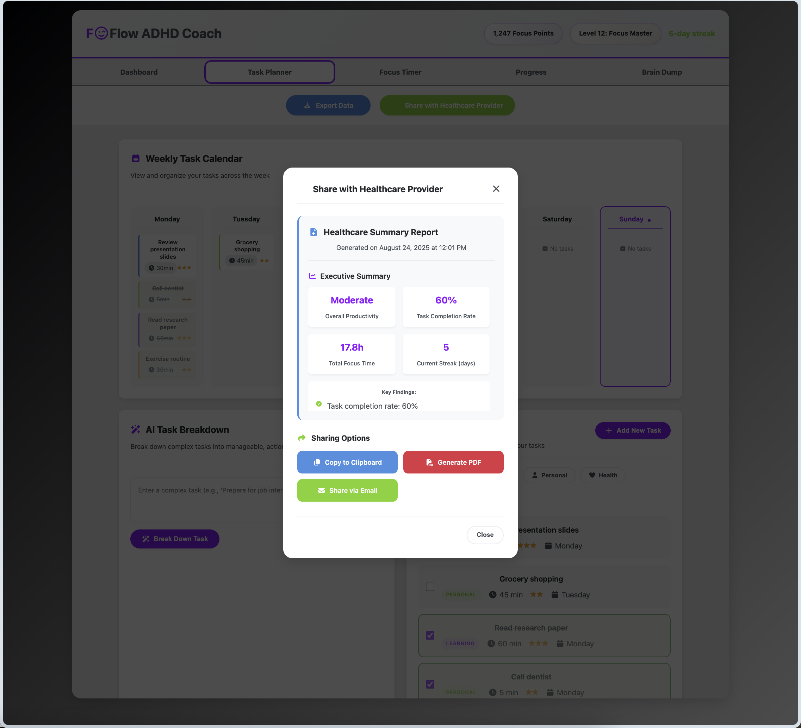

# FOFlow: Personalized ADHD Productivity and Focus Coach

## Overview

FOFlow is an innovative, AI-enhanced productivity coach designed specifically to assist adults with ADHD in managing their daily tasks, improving focus, and tracking progress through evidence-based, neurodivergent-friendly features.

This project was developed to capture and analyze medical data related to neurological conditions.

## Problem Statement

ADHD affects at least 120 million children and hundreds of millions of adults worldwide. Traditional productivity apps fail to address executive dysfunction, time blindness, and motivation challenges specific to ADHD brains. FOFlow bridges this gap with specialized tools and medical data integration.

## Key Features

- **Healthcare Data Export & Sharing:** Generates comprehensive reports that can be exported and shared securely with healthcare providers. Transforms user data into medically relevant metrics.
- **AI-Powered Personalized Task Breakdown:** Uses AI to help users break down complex tasks into manageable steps. Personalized achievement system that responds to user engagement.
- **ADHD-Optimized Pomodoro Timer:** Supports focused work sessions with visual countdown, built-in encouragement and break suggestions.
- **Motivational Rewards:** Gamification elements with dopamine-friendly rewards with badges, points, and streaks to promote productivity.
- **Brain Dump Capture:** Instant thought capture with tagging and organization to reduce cognitive overload.
- **Progress Analytics for Pattern Recognition:** Visualizes weekly productivity and focus trends with easy-to-understand charts. Tracks productivity patterns and identifies optimal focus windows.
- **Accessibility and Responsive Design:** Fully functional across desktop and mobile with attention to accessibility.

## Project Screenshots

## Start Managing ADHD
- Create and break down tasks using AI assistance
- Track focus sessions with the Pomodoro timer
- Monitor progress through analytics dashboard
- Export data to share with healthcare providers

## Healthcare Provider Benefits
- **Clinical Data Export:** Generate comprehensive reports showing task completion rates, focus patterns, and behavioral trends
- **Treatment Insights:** Objective data on medication effectiveness, therapy progress, and lifestyle interventions
- **Patient Engagement:** Visual progress tracking encourages treatment adherence
  

## Technology Stack

- HTML5, CSS3 (modern, responsive design with ADHD-friendly colors)
- JavaScript (app logic, AI integration)
- Chart.js for data visualization

## Future Enhancements
- Real OpenAI API integration for advanced task analysis
- Cloud database with multi-device synchronization
- Integration with wearables for physiological data
- Clinical trial partnerships for validation studies

## How to Run

1. Clone the repository.
2. Open `index.html` in a modern web browser.
3. Try managing your tasks to improve focus!

## License

This project is licensed under the MIT License - see the [LICENSE](LICENSE) file for details.
